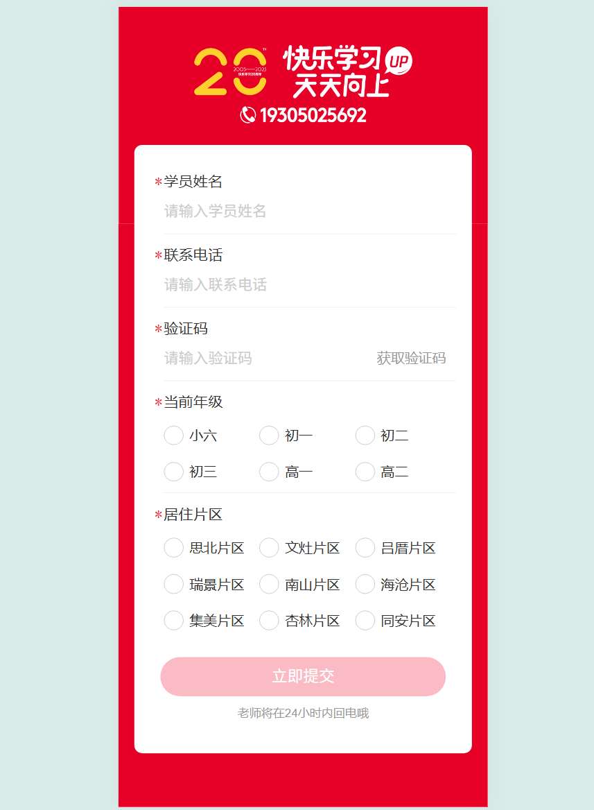

---

# React-Umi4-mobile

基于 Umi 4 + antd-mobile 的移动端前端项目模板，支持现代移动端开发、接口代理、vw 适配等特性。

## 特性

- 基于 Umi 4 框架，支持路由、模型、插件等现代特性
- 使用 antd-mobile 组件库，适配移动端
- px 自动转 vw，适配 375 设计稿
- 支持接口代理，方便本地开发调试
- 支持 TypeScript

## 快速开始

### 安装依赖

建议使用 pnpm（也可用 npm/yarn）：

```bash
pnpm install
```

### 本地开发

```bash
pnpm dev
# 或
npm run dev
```

### 构建生产包

```bash
pnpm build
# 或
npm run build
```

### 目录结构

- `.umirc.ts`：Umi 配置文件，包含路由、代理、PostCSS 等配置
- `src/`：源码目录
- `package.json`：依赖与脚本

## 代理与 API

- 本地开发时，所有 `/api` 和 `/m` 前缀的请求会代理到 `https://op-rls.entstudy.com`
- 生产环境下，`process.env.API_URL` 会自动设置为线上接口地址

## 移动端适配

- 已集成 `postcss-px-to-viewport`，自动将 px 转为 vw，适配 375 宽度设计稿

## 依赖

- umi ^4.4.9
- antd-mobile ^5.39.0
- ahooks ^3.8.4
- typescript ^5.0.3
- 其他见 package.json

## 其他

如需自定义代理、适配参数等，请修改 `.umirc.ts` 配置文件。

---


## 请求接口的方式
```
import { useRequest } from 'ahooks';
import { getSurveyList } from '@/services/api';
import { Toast } from 'antd-mobile';

export default function SurveyPage() {
  const { data, error, loading, run } = useRequest(
    (params) => getSurveyList(params),
    {
      manual: true,
      onError: (err) => {
        Toast.show({ content: err.message || '获取数据失败' });
      },
    }
  );

  return (
    <div>
      <button onClick={() => run({ pageNum: 1, pageSize: 10 })}>获取数据</button>
      {loading && <div>加载中...</div>}
      {error && <div style={{ color: 'red' }}>出错了：{error.message}</div>}
      {data && <pre>{JSON.stringify(data, null, 2)}</pre>}
    </div>
  );
}


//第二种
  async function fetchData() {
    try {
      const res = await getSurveyList({ pageNum: 1, pageSize: 10 });
      // 处理数据
      console.log('数据：', res);
      Toast.show({ content: '获取成功' });
    } catch (err: any) {
      // 捕获并处理错误
      Toast.show({ content: err.message || '获取失败' });
    }
  }

  ```

  ## 集中错误捕获
   - 已进行401等错误捕获 接口抛出异常提示

  ## 如果要做PC端  将转换插件注释即可 
  ```
  module.exports = {
  plugins: {
    'postcss-px-to-viewport': {
      viewportWidth: 375, // 设计稿宽度
      viewportHeight: 667, // 设计稿高度
      unitPrecision: 5, // 转换后的精度
      viewportUnit: 'vw', // 转换成的视窗单位
      selectorBlackList: [], // 不转换的类名
      minPixelValue: 1, // 小于或等于1px不转换为视窗单位
      mediaQuery: false, // 是否在媒体查询中转换px
      exclude: [/node_modules/] // 忽略某些文件夹下的文件
    }
  }
}

```

## 完整示例页面  pages/home/index.tsx


